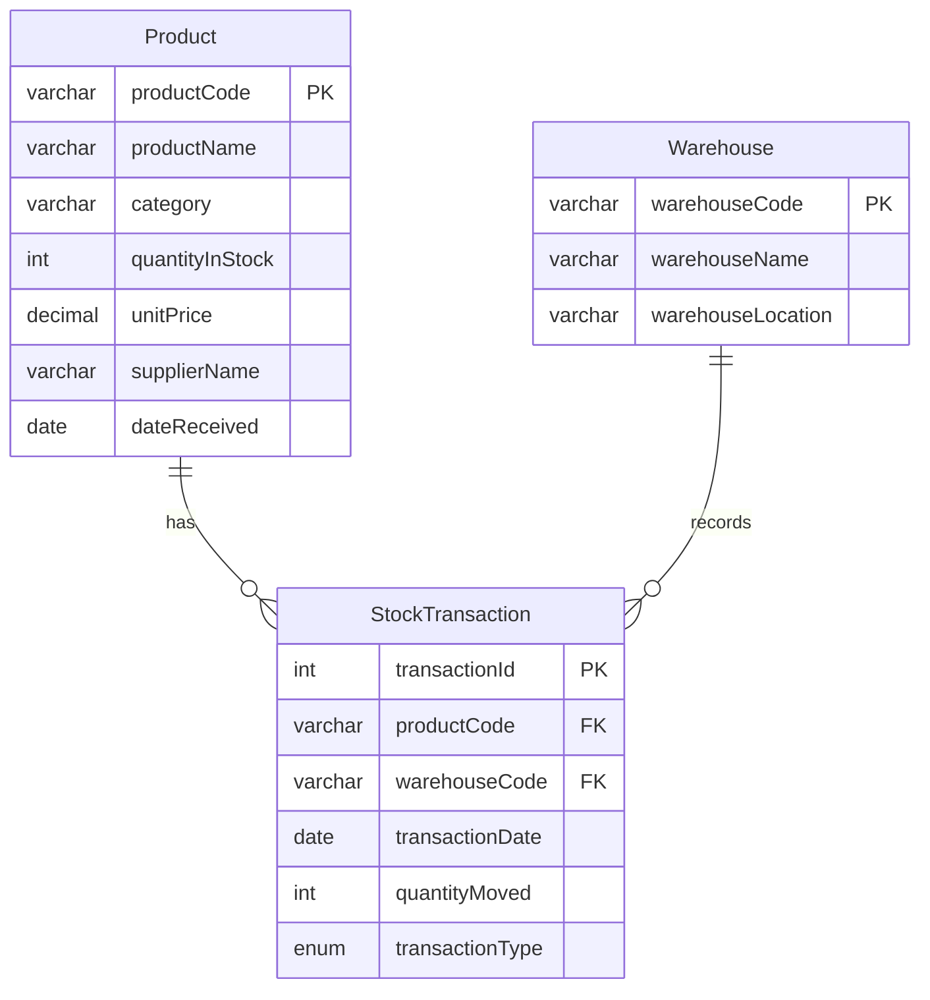

# Entity Relationship Diagram

## Entities

Product

- `productCode` PK
- `productName`
- `category`
- `quantityInStock`
- `unitPrice`
- `supplierName`
- `dateReceived`

Warehouse

- `warehouseCode` PK
- `warehouseName`
- `warehouseLocation`

StockTransaction

- `transactionId` PK
- `productCode` FK references `Product(productCode)`
- `warehouseCode` FK references `Warehouse(warehouseCode)`
- `transactionDate`
- `quantityMoved`
- `transactionType`

## Cardinalities

- One Product can have many StockTransactions.
- One Warehouse can have many StockTransactions.
- Each StockTransaction belongs to exactly one Product and one Warehouse.

